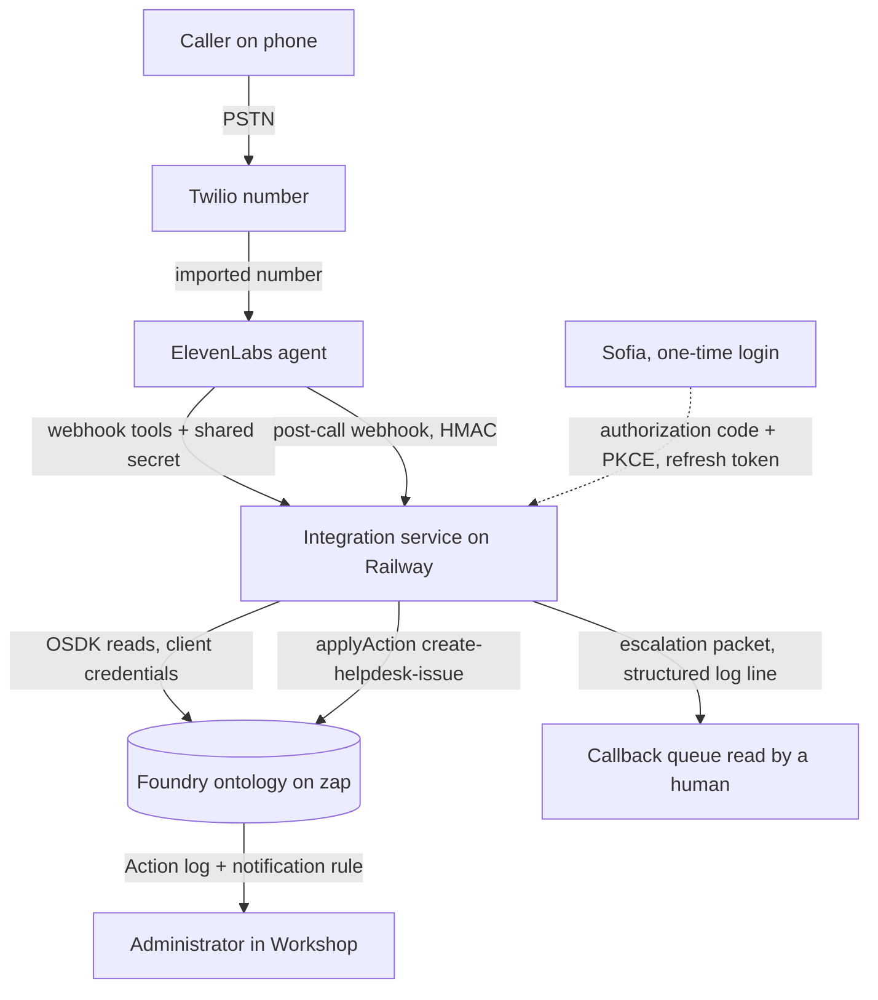
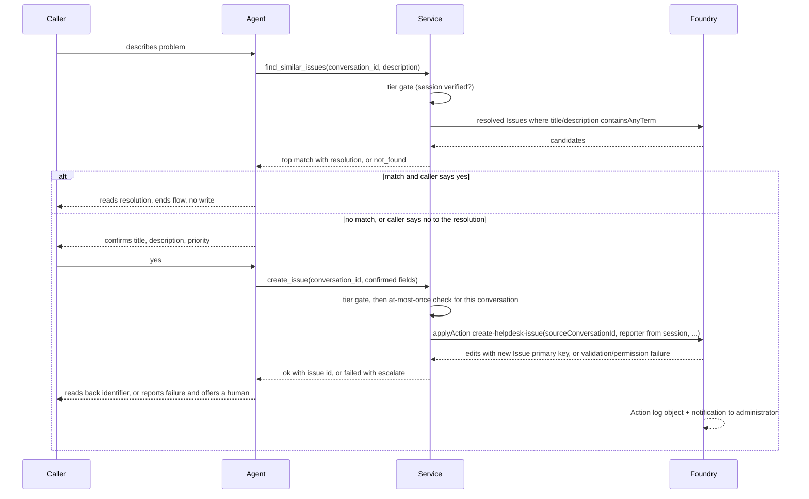
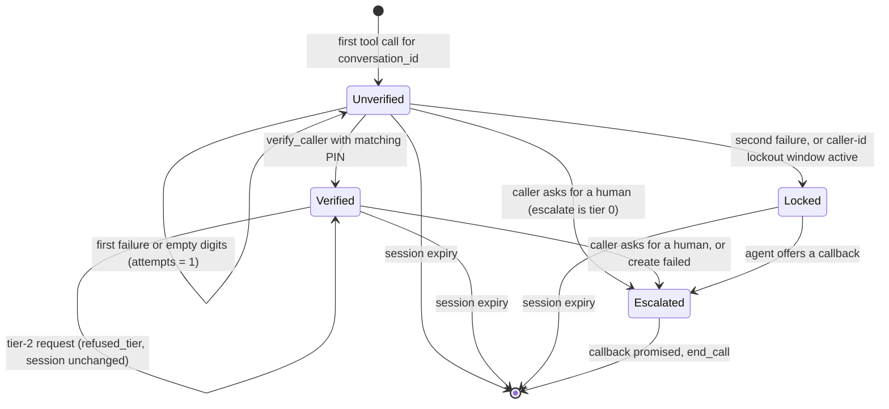
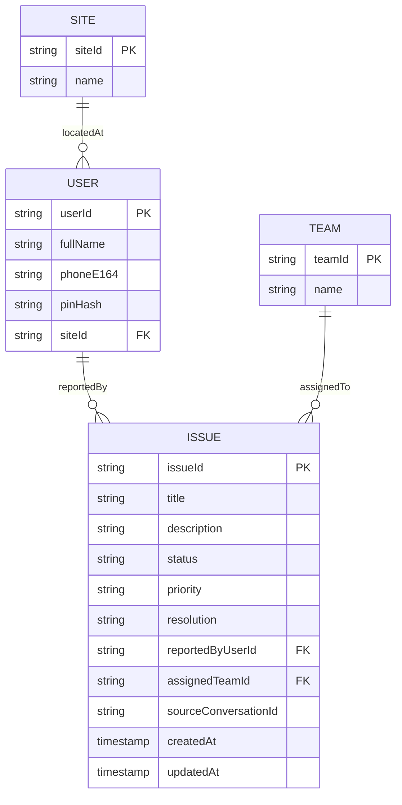

# Voice Help Desk on Palantir Foundry - Plan

## Goal Capsule

- **Objective:** A caller dials a phone number, verifies by keypad PIN, asks an ElevenLabs voice agent about existing help desk issues, describes a new problem, hears it confirmed back, and the resulting Issue object appears in a Foundry Workshop table with an inspectable Action record. Every agent write goes through one Foundry Action applied by an integration service that holds the only Foundry credential.
- **Authority hierarchy:** The brief at `voice-helpdesk-foundry-brief.md` owns product behavior. This plan's Product Contract carries it forward with stable IDs. The Planning Contract owns implementation mechanism within those constraints. When linked layers disagree, the R wins on product behavior and the KTD wins on mechanism.
- **Execution profile:** Three tracks (Foundry, service, agent) that run in parallel after the integration contract is signed off, then converge on an end-to-end dry run. Seven human gates from the brief (G1 to G7, with G4 split into G4a and G4b in Sequencing) are hard stops. Never stub past a gate or invent a credential.
- **Stop conditions:** Stop and report if G1 shows that a service identity cannot apply Actions on the zap stack; if ElevenLabs keypad capture cannot be made to work on the chosen plan tier; if any secret would have to be committed; or if a unit would require a feature the target environment does not offer.
- **Tail ownership:** After U12 passes and the human signs off at G7, U13 produces the run sheet and limitations write-up. Learnings go to `ce-compound` per brief section 16.

---


## Product Contract


### Summary

Build a demonstrable, honestly caveated help desk voice agent: an ElevenLabs agent over a phone number, a TypeScript integration service on Railway that translates agent tool calls into Foundry OSDK reads and one Action application, a four-object-type ontology with a create-issue Action, and a Workshop table an administrator watches. Tiering is enforced in the service, the administrator is notified by a Foundry Action notification rule, and platform-enforced per-caller scoping is a stretch goal that opens only after the dry run.

### Problem Frame

The author is interviewing for a Deployment Strategist role at ElevenLabs and wants evidence of hands-on fluency with the voice platform plus an understanding of what blocks enterprise voice deployments from reaching production. The public argument is that when an agent's write path is a Foundry Action rather than an arbitrary API call, the write inherits permissions, parameter validation, and an audit record, which is what enterprise security review asks about. The build also deepens Foundry ontology, Action, OSDK, and Workshop skills. It is a portfolio artifact, not a production help desk, so it must work end to end and be honest about its limitations without accumulating production hardening (see origin: `voice-helpdesk-foundry-brief.md` sections 1 to 3).

Raava's strategy positions this as a reusable pattern for its agentic delivery stack: a governed Foundry Action as the agent's write path is the argument that gets an agent system through enterprise security review. The write-up should serve both the interview panel and that audience.

### Actors

- A1. **Caller.** An engineer at a large company with a technical problem. Not technical about this system. On a phone, possibly mobile, possibly somewhere noisy.
- A2. **Administrator.** Works out of the Workshop table. Never interacts with the voice system.
- A3. **Integration service.** Holds the Foundry credential. Trusted by Foundry, not trusted by the caller.
- A4. **Voice agent.** Holds no credentials. Can only do what its tools allow.


### Requirements

**Verification**

- R1. The system discloses no account or issue information before verification succeeds.
- R2. The system neither confirms nor denies that a phone number belongs to a known user before verification succeeds.
- R3. PIN entry is by keypad tone, never by speech, and no PIN appears in a stored transcript.
- R4. Failed verification attempts are limited to two, enforced server-side in the integration service, not by prompt instruction alone. The second failure offers escalation, not a third attempt.

**Reads**

- R5. Status and assignee of a specific issue by identifier.
- R6. The caller's own open issues.
- R7. Two-hop traversal: the team assigned to an issue and what else is in that team's queue.
- R8. A count of open issues scoped to the caller's site.
- R9. Similar-issue search over prior issue text that returns the resolution where one exists, and reports nothing found when nothing matches.
- R10. Read results are shaped for speech: aggregates and top-N with an offer to continue, never a list of twelve items.

**Writes**

- R11. Issue creation goes through a Foundry Action, never a direct object write.
- R12. The Action validates its parameters and fails closed when the applying identity lacks permission.
- R13. The agent confirms the issue details back to the caller before the Action is applied.
- R14. The resulting Action record is inspectable in Foundry and is shown during the demo.

**Escalation**

- R15. The caller can ask for a human at any point.
- R16. Anything outside the defined tools routes to escalation rather than improvisation.
- R17. Escalation carries context forward so the caller does not repeat themselves. In this build there is no live human line, so escalation is a recorded callback request: the context packet is stored for the person who calls back, and the agent tells the caller so.
- R18. Tools are tiered by verification level. Tier 1 covers the caller's own reads and issue creation. Tier 2 covers anything touching another person's work and is refused with escalation in this build.

**Observability**

- R19. Every tool call is logged with a correlation identifier that ties the conversation to the resulting Foundry Action.
- R20. Time to first audio is measured, not estimated, with a median target under 800 ms and a 95th percentile under 1.5 s.

**Constraints**

- R21. Synthetic data only. No real company, customer, or employee data.
- R22. Secrets are never committed. Retention settings are a recorded decision, not a default.
- R23. Every shortcut is documented and stated aloud during the demo. The static PIN is presented as a shared secret with the production alternative named.
- R24. The seven human gates in the brief's section 11 halt execution until the human clears them.


### Key Decisions

- D1. **One caller persona, administrator is a viewer only** (session-settled: user-directed — chosen over a second calling persona: it doubles the authorisation model and splits the demo into two calls). Governs R6, R18.
- D2. **The integration service sits between the agent and Foundry** (session-settled: user-directed — chosen over direct agent-to-Foundry and Foundry-initiated egress: a voice vendor must not hold a Foundry token, and dev-tier egress is unlikely to be permitted). Governs R11, R12, R19.
- D3. **Phone number identifies, it does not authenticate** (session-settled: user-directed — chosen over trusting caller ID: it is trivially spoofable). Governs R1, R2.
- D4. **Authentication is a keypad-entered PIN** (session-settled: user-directed — chosen over a spoken passphrase: speech lands in transcripts, is replayable, and recognition on arbitrary secrets is unreliable). Governs R3, R4.
- D5. **Actions are tiered by verification level** (session-settled: user-directed — chosen over flat trust for verified callers). Governs R18.
- D6. **Four object types only: User, Issue, Site, Team, with three links** (session-settled: user-directed — chosen over a richer ontology: sufficient for every read including two-hop traversal). Governs R5 to R9. For the sake of the demo, all objects belong to one project folder and are isolated from the rest of the ontology.
- D7. **Similar-issue search must be able to fail visibly** (session-settled: user-directed — chosen over always-succeeding retrieval: it is not believable). Governs R9.
- D8. **Synthetic data only** (session-settled: user-directed). Governs R21.


### Key Flows

- F1. **Identify and verify**
  - **Trigger:** Inbound call reaches the agent.
  - **Actors:** A1, A3, A4
  - **Steps:** Agent greets without naming the caller. Agent asks for the PIN by keypad. Digits arrive as a keypad turn and the agent calls the verify tool with the digits and the conversation identifier. The service matches caller ID to a User, checks the PIN hash, and returns verified or a neutral failure. On the second failure the service returns a locked state and the agent offers escalation.
  - **Covered by:** R1 to R4, R17
- F2. **Read**
  - **Trigger:** A verified caller asks about issues.
  - **Actors:** A1, A3, A4
  - **Steps:** Agent calls one read tool with the conversation identifier. The service rejects the call unless the session is verified, runs the OSDK query, shapes the result for speech, and returns it. The agent reads the speech text and offers to continue where there is more.
  - **Covered by:** R5 to R10, R18
- F3. **Write**
  - **Trigger:** A verified caller describes a new problem.
  - **Actors:** A1, A2, A3, A4
  - **Steps:** Agent calls the similar-issue tool. If a resolved match exists, the agent reads the resolution and asks whether it resolves the problem; yes ends the flow with no write, no falls through to creation. Otherwise the agent confirms title, description, and priority back to the caller and calls the create tool only after an explicit yes. The service applies the Foundry Action with the conversation identifier as a parameter, reads the new primary key from the returned edits, and returns the identifier. The Issue appears in the Workshop table and the Action notification reaches the administrator.
  - **Covered by:** R9 to R14, R19


### Acceptance Examples

- AE1. **Unverified read is refused.** Given an unverified caller, when they ask for their open issues, then the agent declines and asks for verification, and no issue data is disclosed. Covers R1, R2.
- AE2. **Two PIN failures then escalation.** Given a caller who enters a wrong PIN, when the agent reports failure and offers one retry and the retry also fails, then the agent offers escalation and does not offer a third attempt. Covers R4.
- AE3. **Status by identifier.** Given a verified caller and a known issue identifier, when they ask its status, then the agent reports status and assignee. Covers R5.
- AE4. **Two-hop traversal.** Given a verified caller, when they ask who is working on their issue and what else that team has open, then the agent traverses Issue to Team to Issues and answers with a count and top items. Covers R7, R10.
- AE5. **Known resolution, no new issue.** Given a verified caller describing a problem matching a resolved prior issue, when the agent reads back the resolution and the caller says yes, then no new issue is created. Covers R9.
- AE6. **New issue created.** Given a verified caller describing a problem with no prior match, when the agent confirms details and applies the Action, then it reads back the new identifier and the object appears in the Workshop table. Covers R11, R13, R14.
- AE7. **Fail closed.** Given the Action is applied by an identity that fails the Action's submission criteria (the demo user removed from the writers group), when the agent attempts creation, then the Action fails, the agent reports it could not create the issue and escalates, and never claims success. Covers R12.
- AE8. **Slow tool covered by speech.** Given the service is artificially slowed, when a tool runs, then the agent covers the gap with speech and the experience stays acceptable. Covers R20.
- AE9. **Interruption.** Given the agent is reading issue details, when the caller interrupts, then the agent stops and responds to the interruption. Covers R10.


### Scope Boundaries

**In scope:** voice agent, integration service, ontology, Action, seeded synthetic data, Workshop module with issue table and Action log, administrator notification, tests against the acceptance examples, latency instrumentation, demo run sheet, limitations write-up.

**Outside this product's identity:** multi-tenancy, production authentication such as SMS one-time codes or SSO, real telephony scale, internationalisation, object types beyond the four, issue resolution workflow beyond creation, anything requiring a paid Foundry tier feature the zap stack does not offer, retry queues, circuit breakers, caching layers, horizontal scaling.

#### Deferred to Follow-Up Work

- Platform-enforced per-caller permission scoping (KTD6). Opens only after G7 sign-off.
- Semantic or vector similar-issue search. Keyword search ships first (KTD9).
- A built tier-2 Action. Tiering is enforced by refusal in this build (KTD5).
- Moving the brief to `docs/product/voice-helpdesk-foundry-brief.md` as its header suggests. Left in place so the `origin` path stays valid.
- Live transfer to a human line with the context packet as the hand-off message. No such line exists for this build (user-directed); escalation is a recorded callback request (KTD12).
- Surfacing escalation packets in Workshop rather than in the service log.


### Open Questions

**Deferred to implementation (non-blocking):**

- Whether the Issue object type lands on Object Storage v2 on zap, which decides if the Workshop table auto-refreshes or needs a refresh control (U5).
- The exact OAuth scope strings the Developer Console app needs. Read them from the console at U1; docs are inconsistent.
- The SIP versus native Twilio path for the number. Native Twilio import is the default (KTD12); SIP only if Twilio import fails on the chosen ElevenLabs tier. There is a Twilio account we can use so that is the preferred direction.


### Sources

- Brief: `voice-helpdesk-foundry-brief.md` (sections 4, 5, 9, 11, 12 are load-bearing).
- Prior Raava Foundry work, reusable as patterns: `../sms_sr/app/src/lib/ontologyActions.ts` (REST action apply with error extraction), `../sms_sr/functions/typescript-functions/src/granola/client.ts` (credential-as-provider client with response bodies kept out of errors), `../sms_sr/HANDOFF.md` ("Gotchas that will bite"), `../sms_sr/app/vitest.config.ts` and `../sms_sr/tsconfig.base.json` (conventions), `../raava-signal-agent/scripts/check-no-send.sh` (structural safety guard tested against a planted violation).
- Stack facts: `../../foundry-stack-state.md` (zap host, ontology RID and api name, project layout). `../../tooling-reference.md` (pltr profile `zap`, Keychain secrets).
- Offline Foundry docs mirror: `../../Raava Training Program/knowledge-base/foundry/` (developer-console, ontology-sdk, action-types, workshop sections).
- ElevenLabs docs consulted 2026-09-09: server tools and workspace secrets, `dtmf_input_settings` (changelog 2026-08-31), `end_call`, `pre_tool_speech`, retention and zero-retention mode, post-call webhooks and signature verification, simulate-conversation API, `@elevenlabs/cli` agents-as-code.
- Foundry docs consulted 2026-09-09: bootstrapping a server-side TypeScript app, writing OAuth2 clients, Action permissions, Action log, set up a notification, TypeScript OSDK reads and aggregations, Workshop object table and auto-refresh, hosting an application on Foundry, compute modules sources.

---


## Planning Contract


### Key Technical Decisions

- KTD1. **TypeScript service, Node 22, Fastify, vitest, eslint flat config, pnpm.** Mirrors the `sms_sr` conventions so patterns and tests carry across. Pure logic lives in `service/src/lib/` with no OSDK imports so it is unit-testable; OSDK and HTTP live at the edges.
- KTD2. **Deploy the service to Railway** (session-settled: user-directed — chosen over hosting inside Foundry: Foundry web hosting is frontend-only and login-gated, and compute modules are callable only from inside Foundry, so any Foundry-hosted endpoint would need the voice vendor to hold a Foundry token, which D2 forbids; also chosen over an ngrok static domain because the demo path must not depend on a laptop tunnel). Local iteration uses an ngrok static domain until G6. Governs R19, R24.
- KTD3. **Foundry auth is a Developer Console client-facing application with user permissions, driven by the service through the authorization-code grant with PKCE and `offline_access`.** G1 found that the zap enrollment plan has no client-credentials grant, so no service user can be minted; the brief's risk for this gate fired as designed. The service therefore acts under a delegated user identity: the human logs in once through the service's `/auth/start` route, the service exchanges the code at the Multipass token endpoint, keeps the access token and the rotating refresh token in memory, and refreshes unattended (Foundry rotates refresh tokens on every use and invalidates them after 30 days idle). Railway's disk is ephemeral, so a restart requires one re-authorisation click, listed in the run sheet pre-flight. The app's resource access restrictions still bound the token to the four object types and the Action, which preserves the scoped-credential story. The generated SDK comes from that app (generated and versioned in the Developer Console UI; installed with the npm command and registry token the console shows, recorded in `ontology/README.md` at U1). There is no restricted twin application; fail-closed behaviour for AE7 comes from the Action's submission criteria (KTD4a). The production alternative, a confidential client with a service user, is named in U13. Governs R11, R12.
- KTD4. **Administrator notification is a Foundry Action notification rule** (session-settled: user-directed — chosen over an outbound webhook to a chat channel: no egress, no second write path, configured in Ontology Manager). Recipient is a static Foundry user because notification recipients must be Foundry principals, and the synthetic User objects are not Foundry users. Governs R14.
- KTD4a. **Fail-closed demo uses the Action's submission criteria.** The create-issue Action requires the submitting user to belong to the group `voice-helpdesk-writers`. For AE7 the human removes their own membership for one call; Foundry evaluates the criterion server-side at submission and refuses, the service maps the failure to `failed` with escalation, and the agent never claims success. Membership is restored before the next call. This replaces the restricted-application mechanism, which needed a second identity the enrollment cannot provide. Governs R12.
- KTD5. **Tiering is enforced by a tool registry in the service; no tier-2 Action is built** (session-settled: user-directed — chosen over building a tier-2 Action or stating tiering in the write-up only: cheapest way to make D5 visible and testable). Each tool declares a tier; tier-1 tools additionally check that the requested object belongs to the verified caller. A read by identifier of an object the caller does not own returns `not_found` with the same speech as an unknown identifier, so the service is not an existence oracle over the identifier space. `refused_tier` is returned only for tool names or requests that have no tier-1 tool, and it carries an escalation result. Governs R18.
- KTD6. **Platform-enforced per-caller scoping is a stretch goal that opens after G7** (session-settled: user-directed — chosen over in-scope-from-start and out-of-scope: most impressive capability, most expensive, depends on what G1 permits). Recorded in Deferred to Follow-Up Work with no active unit.
- KTD7. **PIN capture uses ElevenLabs native keypad capture with** `redact_input: true` **and hash termination; the service stores a peppered PIN hash per User and enforces the two-attempt limit keyed by conversation identifier.** Research shows captured digits reach the agent's language model as a keypad turn and `redact_input` hides them from stored transcripts, logs, and analysis only. The ElevenLabs changelog of 2026-08-31 states that digits passed to tools remain unchanged, so the verify tool-call record holds the PIN. R3 is therefore met for the transcript turn and partially met for the tool-call record; both facts are recorded as a limitation in U13 with the production alternative named: collect the PIN in the telephony layer before the call reaches the agent. The hash is HMAC-SHA256 with a `PIN_PEPPER` secret held only by the service, because a plain salted hash of four digits is cracked offline in milliseconds and the seed CSV is committed. A second counter keyed by caller id locks that number after six failures in fifteen minutes with the same wording as any other failure, so an attacker cannot reset the two-attempt limit by redialling; unknown numbers are counted too. Both counters are in-memory maps in the single service instance and clear on restart; that is acceptable because scale is out of scope and is stated in U13. Governs R3, R4.
- KTD8. **Every tool call carries the ElevenLabs conversation identifier and the service is the only place verification state lives.** Tools receive `system__conversation_id` and `system__caller_id` as body fields. The service keeps a session per conversation: unverified, verified for user X, or locked. Read and write tools refuse unless the session is verified, regardless of what the prompt says. A call with no conversation identifier, including a verify call, is refused and never creates a session, so attempts are always counted. After verification the service ignores the caller id field; the session-bound user is the only identity used for ownership checks and for the Issue's reporter. The agent supplies title, description, and priority on create; the service sets reporter, assigned team (the seeded triage team), and conversation identifier. Sessions expire after the agent's maximum conversation duration so a reused conversation identifier cannot replay a verified state. Verification does not survive a call: a callback is a new conversation and verifies again. Governs R1, R4, R19.
- KTD17. **Silence and spoken digits are handled at the boundary, and both count against the caller.** When the keypad timeout passes with no digits, the agent calls the verify tool with empty digits so the service, not the prompt, counts the attempt. If the caller speaks the PIN aloud, the prompt instructs the agent to refuse it and ask for keypad entry without calling the tool; the service cannot tell a spoken digit string from a keypad one, so this guardrail is prompt-only and is listed as a limitation in U13. Phone numbers are unique per User in the seed; shared phones are a production edge case noted in U13, not handled. Timing differences between known and unknown numbers are accepted: one hash compare is far below phone network jitter. Governs R2, R3, R4.
- KTD9. **Similar-issue search is keyword search over resolved issues using OSDK term operators, ranked in the service.** The service extracts salient terms from the caller's description, queries resolved Issues with `$containsAnyTerm` on title and description, scores by term overlap, and returns the top match only when its score clears a threshold. Below the threshold it returns nothing found, which is the D7 visible-failure path. Vector search needs an embedding pipeline and is deferred. Governs R9.
- KTD10. **Audit is the Action Log object type plus the conversation identifier stored on the Issue.** The create-issue Action has "Create action log objects" enabled, and takes `sourceConversationId` as a parameter written to the Issue. Workshop shows the Object Table and the Action Log Timeline widget. Correlation in the other direction comes from the service log line per tool call, which carries the conversation identifier, tool name, duration, and, for creates, the new Issue primary key. Platform audit-log export is not used because it needs an admin-only permission. Governs R14, R19.
- KTD11. **Tool responses are small JSON with a** `speech` **field plus minimal structured fields.** The service pre-phrases the spoken answer (top three items, a count, and a "there are N more" offer), and includes identifiers and a `status` of `ok`, `not_verified`, `locked`, `not_found`, `refused_tier`, `failed`, or `escalate`. Team-queue speech carries issue identifier, title, and status only, never another reporter's name or description. No hard response-size limit is documented, so the service keeps responses under two kilobytes. Governs R10, R16.
- KTD12. **Agent configuration is code via** `@elevenlabs/cli`**, and telephony is a Twilio number imported into ElevenLabs.** Tools authenticate to the service with a shared secret in a header sourced from an ElevenLabs workspace secret. `pre_tool_speech` is `auto`, with `force` for the create tool. Tool timeout is ten seconds; on a tool error or timeout the prompt has the agent say the system is unavailable and offer a human, and it retries a create at most once. Escalation has no live human line in this build (session-settled: user-directed — chosen over a `transfer_to_number` hand-off: no destination exists for the demo). The agent calls the escalate tool, which records the context packet as a structured log line for the person who calls back, then tells the caller a person will call them back and ends the call with `end_call`. The packet contains no digits, no caller id, and no User name unless the session is verified. Tool definitions mark the conversation and caller id parameters as system-sourced dynamic variables, never model-filled. ElevenLabs does not sell numbers directly, so the number is bought in Twilio (G5). Governs R15, R17, R20.
- KTD13. **Latency is measured from ElevenLabs per-turn metrics plus service-side tool timings, both emitted as structured log lines.** The post-call webhook delivers per-turn metrics keyed by conversation identifier inside each transcript entry; the service verifies the signature over the raw body, extracts each entry's `conversation_turn_metrics` and tool-call names, discards message text, and logs one structured line per turn beside the tool-timing lines. The webhook exposes only `convai_llm_service_ttfb` and `convai_llm_service_ttf_sentence`, so the reported R20 figure is time to first sentence, labelled as such; true time to first audio adds text-to-speech latency the webhook does not expose. U14 checks the conversation detail API for an audio-start metric and switches to it if one exists. Nothing is written to the Railway filesystem because it is ephemeral. A script reads the exported log and reports median and 95th percentile time to first audio and per-tool duration. Governs R20.
- KTD14. **Retention recommendation for G4: keep transcripts for 14 days with keypad redaction on, not zero-retention, knowing the verify tool-call record holds the PIN (KTD7).** Transcripts are needed to inspect AE runs and to write up recognition findings. Zero-retention would remove that evidence. The human makes the final call at G4 and the chosen value is recorded in U13. Governs R22.
- KTD15. **Issue creation is at most once per conversation.** The per-conversation record is written as pending with the request fields before the Action is called; a retry with the same fields while pending awaits the same in-flight result, and a retry after completion returns the recorded identifier, so the Action is never applied twice; a second create with different fields in the same conversation returns `failed` with escalation, because one issue per call is the demo. The new primary key is read from the Action's returned edits, never by re-querying, because the search index lags writes. One outcome stays ambiguous: the Action applies but the response is lost before the service records it. The service cannot reconcile that without re-querying, so it is a stated limitation in U13, not a retry path. Governs R11, R13.
- KTD16. **Issue identifiers are short numeric strings such as** `4127`**, read digit by digit.** Speech recognition on alphanumeric codes is a known risk; digits are the safest shape. A form-based Action cannot mint such an identifier (only UUID prefill exists), so the service draws a four-digit `issueId` from 5000 to 9999, passes it as a required Action parameter, and redraws once on a duplicate-key validation failure; seed identifiers stay below 5000. The verify tool and the status tool normalise spoken digits ("forty-one twenty-seven") in the service before lookup. Recognition accuracy is tested in U14 and reported in U13. Governs R5.


### High-Level Technical Design

Component topology:




Create flow (F3) as a sequence:




Verification session state, owned by the service per conversation:




Ontology shape:




The site-scoped count (R8) is a two-hop pivot: caller's Site to Users to Issues with open status, aggregated by count. The pivot is primary because AE4 already forces pivots from Node, so R8 reuses a mechanism U8 must prove anyway. If the pivot chain proves awkward in the generated client, the fallback is two reads in the service: Users at the caller's site, then a count of open Issues whose reporter is in that list. No schema or Action change either way. The Action Log object type generated in U4 is a Foundry system artifact, not a domain type, so D6 holds. `pinHash` is a peppered HMAC (KTD7), so no salt property is needed.

### Tool contract (owned by U2, summarised here)


| Tool                       | Tier | Input beyond conversation and caller ids | Speech-shaped output                                 |
| -------------------------- | ---- | ---------------------------------------- | ---------------------------------------------------- |
| `verify_caller`            | 0    | keypad digits                            | verified, try again, or locked with escalation offer |
| `get_issue_status`         | 1    | issue id                                 | status, assigned team, last update                   |
| `list_my_open_issues`      | 1    | none                                     | count plus top three, offer to continue              |
| `get_team_queue_for_issue` | 1    | issue id                                 | team name, open count, top three                     |
| `count_site_open_issues`   | 1    | none                                     | single number with site name                         |
| `find_similar_issues`      | 1    | free-text description                    | one resolution or not found                          |
| `create_issue`             | 1    | title, description, priority             | new issue id, or failed with escalation              |
| `escalate`                 | 0    | reason                                   | callback promise; context packet recorded server-side |


Tier 0 tools work before verification. Tier 1 tools require a verified session and refuse objects not owned by the caller. Tier 2 has no tools; any such request is refused by the registry with an escalation result (KTD5).

### Sequencing and gates

G4 from the brief is split in two because the retention decision depends on what the keypad spike finds: **G4a** is the workspace and plan tier, needed before U14; **G4b** is the retention decision, made after U14 and before U10.


| Phase                          | Units               | Gate that unblocks                                              | Rough effort |
| ------------------------------ | ------------------- | --------------------------------------------------------------- | ------------ |
| A. Prove the risky assumptions | U1, U14, U3, U2     | G1 and G3 for U1; G4a and G5 for U14; G1 for U3                        | 2 days       |
| B. Foundry track               | U4, U5              | G2                                                              | 1.5 days     |
| C. Service track               | U6, U7, U8, U9, U15 | G2; G3 for live calls; G4a for the webhook secret               | 3 days       |
| D. Agent track                 | U10, U11            | G4b and U2 for prompt and tests; G6 for tool URLs; G5 for phone | 1.5 days     |
| E. Convergence                 | U12, U13            | G7 between them                                                 | 1.5 days     |


Tracks B, C, and D run in parallel once G2 clears. U2's tool list, header convention, and status enumeration are drafted before U1 so the spike's echo tool uses the real convention; U2's error and escalation sections wait for U1 and U14 findings. Within C, U7 and its tests need no Foundry access and can start the day G2 clears.

### System-Wide Impact

- **Agent to service:** eight POST tools with a shared-secret header; the body carries conversation and caller identifiers; the envelope is `speech` plus `status`. U2 owns the shape; U9 and U10 consume it. Any envelope change after G2 reopens G2 and touches U2, U9, and U10 together.
- **Service to Foundry:** one generated OSDK package under one public client id; the service holds the delegated user's access and refresh tokens in memory. AE7 is a group-membership change in Foundry, a manual run-sheet step, never runtime logic.
- **ElevenLabs to service:** the HMAC-verified post-call webhook is the only inbound path besides tools and health.
- **Escalation exit:** there is no live transfer. The escalate tool records the packet as a structured log line and the agent ends the call after promising a callback; the run sheet shows where to read the packet.
- **State:** verification state lives only in service memory keyed by conversation id; a restart returns `not_verified` and the agent asks for the PIN again. Foundry holds the only durable state (Issue, Action log); everything else is rebuildable from logs.
- **Failure propagation:** a Foundry read or Action failure becomes `failed` plus escalation and the agent never claims success. A service outage surfaces as a tool error the prompt must route to escalation (KTD12), which is the one prompt-only handling in the system. A call dropped after the Action applied but before read-back leaves an Issue the caller does not know about; that is a stated limitation. Workshop and the notification are asynchronous and never block the caller; if the notification rule fails the run sheet falls back to opening the Action log directly. If the escalate tool itself fails, the prompt still has the agent promise a callback and end the call, never dead air.
- **The agent sees only tool envelopes:** never Foundry errors, response bodies, or hashes.
- **Structural proof:** the U7 guard proves every route gates before any Foundry access.
- **Human-only:** ontology and Action authoring, the notification rule, Twilio purchase, the retention decision, the AE7 client-id switch, and the G7 dry run.


### Risks and Dependencies


| Risk                                                            | Likelihood | Impact   | Mitigation                                                                  | Owner       |
| --------------------------------------------------------------- | ---------- | -------- | --------------------------------------------------------------------------- | ----------- |
| No service identity on zap (confirmed at G1: no client-credentials grant) | Certain | High | Delegated user identity via public client with refresh token (KTD3); AE7 via submission criteria (KTD4a); named as a production gap in U13 | U1, U13 |
| Refresh token lost on Railway restart or 30-day idle | Medium | Low | One-click re-authorisation in the run sheet pre-flight | U8, U13 |
| zap network ingress allowlist blocks API calls from non-allowed addresses (observed 2026-09-09 from IP geolocated to Brazil) | Certain | High | Run sheet pre-flight: local machine on an allowed network or VPN; at G6 confirm Railway's region or static egress IPs are allowed, request an ingress change in Control Panel if not; write-up names it as a production integration prerequisite | U6, U12, U13 |
| Caller id spoofing                                              | High       | Medium   | D3, D4, per-number lockout, stated in write-up                              | U7, U13     |
| Static PIN replay                                               | Medium     | High     | Accepted for the demo; peppered hash; stated                                | U3, U7, U13 |
| Brute force across redials                                      | Medium     | Medium   | Per-number lockout window (KTD7)                                            | U7          |
| PIN visible in transcript or tool parameters                    | Medium     | High     | U14 check, metrics-only logging, G4b retention                              | U14, U15    |
| Shared secret leak                                              | Low        | High     | Header check before body parsing, log redaction, rotation, dockerignore     | U6          |
| Issue-existence oracle                                          | Medium     | Low      | Collapse foreign objects to `not_found` (KTD5)                              | U7, U9      |
| Model-supplied identity on write                                | Medium     | Medium   | Service sets reporter and team from session (KTD8)                          | U2, U9      |
| Escalation packet leaks digits or caller id                     | Low        | Medium   | Packet built server-side from the session only (KTD12)                      | U9          |
| Tunnel URL churn and OSDK drift                                 | Medium     | Medium   | Railway from the start (KTD2); verify against the generated client          | U6, U8      |
| Identifier recognition accuracy                                 | Medium     | Medium   | U14 spike; digit-by-digit read-back (KTD16)                                 | U14, U13    |
| Railway restart clears sessions and lockouts                    | Medium     | Low      | Re-verify on `not_verified`; pre-flight Foundry read in the run sheet       | U9, U13     |


### Assumptions

- The zap enrollment allows creating a Developer Console backend-service application and its service user can be granted Action apply rights. This has never been tested at Raava and is exactly what U1 proves. If false, stop per the Goal Capsule.
- The ElevenLabs plan tier chosen at G4 supports importing a Twilio number and native keypad capture. Both appear available below Enterprise, but the tier requirement for SIP is unclear, which is why Twilio import is the default.
- Foundry rate limits on the zap stack are not a factor at demo call volume.

---


## Output Structure

```text
elevenlabs/
  voice-helpdesk-foundry-brief.md
  docs/
    plans/2026-09-09-001-feat-voice-helpdesk-foundry-plan.md
    contract/integration-contract.md          # U2, signed at G2
    demo/run-sheet.md                          # U13
    demo/limitations.md                        # U13
    demo/latency-report.md                     # U12 output
    solutions/                                 # ce-compound later
  ontology/
    seed/generate-seed.ts                      # U3, synthetic CSVs
    seed/*.csv
    README.md                                  # Ontology Manager click path, RIDs, api names
    action-create-helpdesk-issue.md            # U4 spec: parameters, validation, log, notification
  service/
    package.json, tsconfig.json, vitest.config.ts, eslint.config.js
    Dockerfile, .dockerignore, railway.json, .env.example
    src/server.ts, src/config.ts
    src/lib/{sessions,verification,tiers,speech,similarity,idempotency,identifiers}.ts
    src/lib/__tests__/*.test.ts
    src/foundry/{client,reads,actions,errors}.ts
    src/routes/{tools,postcall,health}.ts
    src/observability/{log,timing}.ts
    scripts/latency-report.ts
    scripts/probe-foundry.ts                   # U1
  agent/
    agents.json, tools.json, tests.json
    agent_configs/helpdesk.json
    prompts/system.md
  scripts/check-no-disclosure.sh               # U7 structural guard
```

---


## Implementation Units


| U-ID | Title                                                  | Key files                                                                                    | Depends on                            |
| ---- | ------------------------------------------------------ | -------------------------------------------------------------------------------------------- | ------------------------------------- |
| U1   | Foundry access spike                                   | `service/scripts/probe-foundry.ts`, `ontology/README.md`                                     | G1, G3                                |
| U14  | Keypad capture and identifier recognition spike        | throwaway agent under `agent/`, `ontology/README.md`                                         | G4a                                   |
| U2   | Integration contract                                   | `docs/contract/integration-contract.md`                                                      | U1, U14 (partial draft precedes both) |
| U3   | Ontology and synthetic seed                            | `ontology/seed/*`, `ontology/README.md`                                                      | G1, U1 findings                       |
| U4   | Create-issue Action, log, notification, writers group | `ontology/action-create-helpdesk-issue.md`                                                   | U3, G2                                |
| U5   | Workshop module                                        | Foundry only, documented in `ontology/README.md`                                             | U4                                    |
| U6   | Service scaffold and deploy                            | `service/*` root, `src/server.ts`, `src/routes/health.ts`                                    | U2                                    |
| U7   | Sessions, verification, tiers, guard script            | `service/src/lib/*`, `scripts/check-no-disclosure.sh`                                        | U6                                    |
| U8   | Foundry adapter                                        | `service/src/foundry/*`                                                                      | U4, U6, U7 (session type), G3         |
| U9   | Tool routes and speech shaping                         | `service/src/routes/tools.ts`, `src/lib/speech.ts`, `src/lib/idempotency.ts`                 | U7, U8                                |
| U15  | Post-call webhook, timing, latency script              | `service/src/routes/postcall.ts`, `src/observability/*`, `service/scripts/latency-report.ts` | U6, G4a                               |
| U10  | Agent as code and simulation tests                     | `agent/*`                                                                                    | U2, G4b; G6 for tool URLs only        |
| U11  | Telephony                                              | ElevenLabs and Twilio consoles, `agent/agent_configs/helpdesk.json`                          | U9, U10, G5                           |
| U12  | Acceptance runs and latency report                     | `docs/demo/latency-report.md`, run sheet evidence table                                      | U5, U9, U11, U15                      |
| U13  | Run sheet and limitations write-up                     | `docs/demo/*`                                                                                | U12, G7                               |


### U1. Foundry access spike

**Goal:** Prove, before any other Foundry work, that a delegated user token obtained through the Developer Console application can read objects and apply an Action from an external process, that the refresh grant works unattended, and that a submission criterion refuses the Action server-side. (G1 already established that no service identity is available on zap.)

**Requirements:** R11, R12, R24. Cites KTD3.

**Dependencies:** G1 (environment and identity), G3 (credentials).

**Files:** `service/scripts/probe-foundry.ts`, `ontology/README.md` (findings section).

**Approach:**

1. In Developer Console on zap, create the client-facing application with user permissions in the `voice-helpdesk` project, redirect URL `http://localhost:3000/auth/callback` (the Railway URL is added at G6), and generate the SDK for a throwaway object type and Action. Record the client id, the application RID, every scope string, and the SDK install command the console shows.
2. From the local service, run the one-time login (`/auth/start`), confirm the callback stores an access token and a refresh token (`offline_access` requested), then force a refresh and confirm rotation.
3. With that token, read one object and apply the throwaway Action. Record success, the error shape on a deliberately invalid parameter, and the error shape when the throwaway Action's submission criterion (group membership) is not met.
4. Confirm the Action log names the delegated user and the application, and that a call to an object type outside the application's scope fails.
5. Paste observed error shapes into the findings with request ids and any token fragments removed.

**Execution note:** This is a spike. Prefer runtime evidence over unit tests; write the findings into `ontology/README.md` and the contract inputs for U2.

**Patterns to follow:** `../sms_sr/app/src/lib/ontologyActions.ts` for reading errors and edits; `../../Raava Training Program/knowledge-base/foundry/developer-console/how-to-bootstrapping-server-side-typescript.md` for the console click path.

**Test scenarios:**

- Client-credentials token reads one object of the throwaway type and the response carries the expected primary key.
- Reading an object type outside the application's scope fails.
- Applying the throwaway Action with valid parameters returns edits containing the new primary key, and the Action log submitter is the service user.
- Applying with a missing required parameter returns a validation failure, not a thrown network error, and the message names the parameter.
- Covers AE7. Applying while outside the throwaway Action's writers group returns a submission-criteria failure and creates nothing.
- The refresh grant returns a new access token and a rotated refresh token; the old refresh token is rejected after the one-minute grace.

**Verification:** A findings section in `ontology/README.md` answers each scenario with observed output, and the Goal Capsule stop conditions are either cleared or triggered.

### U14. Keypad capture and identifier recognition spike

**Goal:** Prove that ElevenLabs keypad capture delivers digits to a webhook tool, learn exactly what `redact_input` hides, and measure recognition of four-digit identifiers, so G4b's retention decision and the U2 contract rest on observation.

**Requirements:** R3, R5, R22. Cites KTD7, KTD14, KTD16.

**Dependencies:** G4a (workspace and plan tier), G5 (a phone number; a trial number is enough).

**Files:** A throwaway agent under `agent/` deleted after the spike; findings in `ontology/README.md`.

**Approach:**

1. Configure a bare agent with keypad capture, hash termination, `redact_input` on, and one webhook tool that echoes what it received to a local endpoint, using the header and body convention from the U2 draft.
2. Enter digits from a phone call over the imported number (G5 is pulled forward for this; a Twilio trial number suffices), with the browser widget as supplementary only. Inspect the stored transcript and the tool-call record for the digits.
3. Have the agent read back three four-digit identifiers spoken in different ways and note recognition accuracy.
4. Capture one post-call webhook payload from the throwaway agent, record the per-turn metric field names, and check the conversation detail API for an audio-start metric (KTD13).
5. Hand the redaction finding to the human for G4b.

**Execution note:** Spike; runtime evidence only.

**Test scenarios:**

- Keypad entry of four digits followed by hash from a real phone call reaches the echo tool as the expected string.
- The stored transcript for that conversation shows the keypad turn redacted; confirm that the tool-call record still shows the digits (KTD7).
- One post-call payload is captured and its per-turn metric field names are recorded.
- Three identifiers spoken as "forty-one twenty-seven", "four one two seven", and "4127" are each recognised and read back correctly, with misses recorded.

**Verification:** Findings recorded in `ontology/README.md`, the human has the redaction result for G4b, and the throwaway agent is deleted.

### U2. Integration contract

**Goal:** Specify the interface between agent and service so the three tracks can proceed in parallel after G2.

**Requirements:** R1, R4, R10, R16, R18, R19. Cites KTD5, KTD8, KTD11, KTD15.

**Dependencies:** U1 and U14 findings for steps 2 and 4; steps 1 and 3 are drafted before the spikes so they use the real convention.

**Files:** `docs/contract/integration-contract.md`.

**Approach:**

1. For each tool in the Tool contract table: method, path, required headers (shared secret, content type), body fields including `conversation_id` and `caller_id` marked as system-sourced, response fields, the `status` enumeration, and the speech text rules. State that create accepts only title, description, and priority (KTD8).
2. Define the error envelope and the escalation context packet (caller name only if verified, verification state, last tool, summary so far; never digits or caller id).
3. State the tier of each tool, the ownership rule for tier 1, and the `not_found` collapse for foreign objects (KTD5).
4. State at-most-once creation (KTD15) and the identifier format from KTD16.
5. Present to the human for G2 sign-off.

**Patterns to follow:** The bold-leader-label style of this plan's flows so the contract is scannable.

**Test scenarios:** Test expectation: none -- this unit produces a document; U7 and U9 tests are derived from it.

**Verification:** The human has signed off at G2 and the contract lists every tool the agent will call with no "to be decided" fields.

### U3. Ontology and synthetic seed

**Goal:** Four object types, three links, value types, and a synthetic dataset that contains the demo scenarios.

**Requirements:** R5 to R9, R21. Cites D6, D7, D8, KTD9, KTD16.

**Dependencies:** G1, U1 findings.

**Files:** `ontology/seed/generate-seed.ts`, `ontology/seed/{users,issues,sites,teams}.csv`, `ontology/README.md`.

**Approach:**

1. Generate CSVs with a deterministic seed: three sites, four teams including a triage team, twelve users with unique phone numbers (one is the demo caller with the demo phone number), forty issues with a mix of open, in progress, and resolved, numeric identifiers between 1000 and 4999, created and updated timestamps, and realistic technical titles. Include one resolved issue that matches the AE5 script closely and make sure the AE6 script matches nothing. PIN hashes are peppered HMACs (KTD7); the generator reads `PIN_PEPPER` from the environment so the committed CSV is useless without the service's pepper.
2. Upload the CSVs as datasets into the dedicated `voice-helpdesk` project created at U1 (KTD3), so the service user's Viewer role covers only these four datasets; use `../../foundry-stack-state.md` only for space placement and folder conventions.
3. In Ontology Manager create User, Issue, Site, Team backed by those datasets, value types for status and priority, and the three link types. Prefer Object Storage v2 so Workshop can auto-refresh.
4. Record api names, RIDs, and the click path in `ontology/README.md`.

**Execution note:** Ontology authoring is manual in the console. Prefer smoke verification through `pltr -p zap` object reads over unit tests for the Foundry side; unit test the seed generator.

**Patterns to follow:** `../../foundry-stack-state.md` for project and folder placement; `../sms_sr/CLAUDE.md` for the api-name-to-export naming rule.

**Test scenarios:**

- Seed generator produces the same CSVs on two runs with the same seed.
- Every Issue references an existing User and Team; every User references an existing Site.
- Exactly one resolved Issue matches the AE5 demo description on at least three salient terms, and no Issue matches the AE6 description on more than one.
- The demo caller's PIN hash verifies against the demo PIN with the same peppered function U7 will use, and fails with a different pepper.
- No two users share a phone number.
- Covers AE3. A `pltr -p zap` read of the demo issue identifier returns status and assigned team.

**Verification:** All four object types are queryable on zap, links resolve in the object view, and the README lists every RID and api name the service needs.

### U4. Create-issue Action, log, notification, restricted app

**Goal:** The only write path: a validated Action with an Action Log, a notification rule, and a submission criterion on a writers group that demonstrates fail-closed behaviour.

**Requirements:** R11, R12, R14. Cites KTD3, KTD4, KTD10.

**Dependencies:** U3, G2.

**Files:** `ontology/action-create-helpdesk-issue.md`, `ontology/README.md`.

**Approach:**

1. Create the Action `create-helpdesk-issue` with parameters: title (required, length bounded), description (required), priority (allowed values from the value type), reportedBy (object reference to an existing User), assignedTeam (object reference to an existing Team), sourceConversationId (string). Status defaults to open; `issueId` is a required string parameter supplied by the service (KTD16).
2. Enable "Create action log objects" and generate the log object type.
3. Add a notification rule with a static recipient (the administrator's Foundry user) and a template that includes title, reporter, and an object link.
4. Add the four object types and the Action to the application's SDK scope and regenerate the SDK.
5. Create the group `voice-helpdesk-writers`, add the demo user, and set the Action's submission criteria to require membership (KTD4a).

**Patterns to follow:** `../../Raava Training Program/knowledge-base/foundry/action-types/action-log.md` and `set-up-notification.md`.

**Test scenarios:**

- Covers AE6. Applying the Action via the main app with valid parameters creates an Issue, and an Action log object exists for it with the service user as submitter.
- Applying with an unknown Team reference fails validation and creates nothing.
- Applying with an empty title fails validation with a message naming the parameter.
- Covers AE7. Applying while the demo user is outside `voice-helpdesk-writers` fails the submission criteria and creates nothing.
- After a successful application the administrator's Foundry notifications show the new issue.

**Verification:** `ontology/action-create-helpdesk-issue.md` records the parameter list, validation rules, and the observed error messages for each failure case.

### U5. Workshop module

**Goal:** The administrator's view: an issue table that shows new issues and an Action log timeline that shows who wrote them.

**Requirements:** R14. Cites KTD10.

**Dependencies:** U4.

**Files:** Foundry only; module RID and layout recorded in `ontology/README.md`.

**Approach:**

1. Object Table widget bound to all Issues, sorted by createdAt descending, columns: identifier, title, status, priority, reporter, team, sourceConversationId.
2. Selected-object detail panel with the Action Log Timeline widget.
3. Enable auto-refresh if the Issue type is on Object Storage v2; otherwise add a refresh button and note it in U13.

**Test scenarios:**

- Covers AE6. Creating an issue through the Action makes it appear at the top of the table within one refresh.
- Selecting that row shows an Action log entry naming the service user, the timestamp, and the parameters.
- The table filter on status open returns the same count the service reports for the site-scoped read on the same data.

**Verification:** A screenshot of the table and the timeline for one demo issue is saved for the run sheet.

### U6. Service scaffold and deploy

**Goal:** A deployable Fastify service with configuration, shared-secret authentication, structured logging with correlation ids, a health route, and a Railway deployment at a stable URL.

**Requirements:** R19, R22. Cites KTD1, KTD2.

**Dependencies:** U2.

**Files:** `service/package.json`, `service/tsconfig.json`, `service/vitest.config.ts`, `service/eslint.config.js`, `service/Dockerfile`, `service/.dockerignore`, `.gitignore`, `service/railway.json`, `service/.env.example`, `service/src/server.ts`, `service/src/config.ts`, `service/src/routes/health.ts`, `service/src/observability/log.ts`, `service/src/routes/__tests__/auth.test.ts`.

**Approach:**

1. Scaffold with the conventions from `../sms_sr` (ES modules, strict TypeScript, vitest with `src/**/__tests__/**/*.test.ts`, eslint with max-warnings zero, scripts `dev`, `build`, `lint`, `typecheck`, `test`, `check`).
2. Configuration reads named environment variables (`FOUNDRY_STACK_URL`, `FOUNDRY_CLIENT_ID`, `FOUNDRY_CLIENT_SECRET`, `FOUNDRY_ONTOLOGY_RID`, `HELPDESK_SHARED_SECRET`, `ELEVENLABS_WEBHOOK_SECRET`, `PIN_PEPPER`, `LOCKOUT_MAX_FAILURES`, `LOCKOUT_WINDOW_MS`, `SLOW_TOOLS_MS`) and fails fast when one is missing. `.env.example` lists names only. `HELPDESK_SHARED_SECRET` accepts a current and a previous value so rotation needs no downtime.
3. The shared-secret check runs in the earliest request hook, before the body is parsed, with a constant-time comparison, so an unauthenticated body is never parsed or logged. JSON content type only, body capped at 16 KB on the tool routes.
4. Logging uses an allowlist of fields (conversation identifier, tool, duration, status, issue identifier) with redaction of the secret header, `digits`, and `pin`; the verify tool's body is never logged.
5. `.gitignore` and `.dockerignore` both exclude `.env` and local data (the `sms_sr` gitignore lacks an `.env` entry, so it is not inherited). Deploy to Railway from the repo with secrets set in the Railway dashboard; record the URL for G6.

**Execution note:** Mostly packaging and configuration. Prefer a deploy-and-curl smoke check over broad unit coverage; unit test the auth pre-handler and config validation.

**Patterns to follow:** `../sms_sr/app/vitest.config.ts`, `../sms_sr/tsconfig.base.json`, `../sms_sr/app/package.json` scripts.

**Test scenarios:**

- Missing required environment variable makes startup fail with the variable's name in the message.
- A tools request without the secret header returns 401 before the body is parsed, and the log line has no body fields.
- A tools request with a wrong secret returns 401; a request with the previous secret during rotation returns 200.
- A body over 16 KB or with a non-JSON content type is rejected.
- A log line for a verify call contains no `digits` value.
- `git check-ignore service/.env` succeeds.
- Health route returns 200 without a secret.
- Setting `SLOW_TOOLS_MS` delays tool responses by that amount (used for AE8).

**Verification:** The Railway URL answers the health check over HTTPS, the human has recorded it for G6, and no secret value appears in the repository.

### U7. Sessions, verification, tiers, guard script

**Goal:** The pure logic that makes the security claims true regardless of the prompt: verification sessions, PIN checking with attempt limits, the tool tier registry with ownership checks, and a structural guard that no read path can run unverified.

**Requirements:** R1 to R4, R18. Cites KTD5, KTD7, KTD8.

**Dependencies:** U6.

**Files:** `service/src/lib/sessions.ts`, `service/src/lib/verification.ts`, `service/src/lib/tiers.ts`, `service/src/lib/identifiers.ts`, `service/src/lib/__tests__/{sessions,verification,tiers,identifiers}.test.ts`, `scripts/check-no-disclosure.sh`.

**Approach:**

1. Session store keyed by conversation identifier with states from the state diagram, an injected clock, and expiry at the agent's maximum conversation duration. A second store keyed by caller id holds the lockout window from KTD7.
2. Verification takes caller id and digits, looks up the User with that phone through an injected lookup function, compares against the stored peppered hash with a constant-time compare, binds the session to the user, increments both counters on failure, and returns `verified`, `retry`, or `locked`. Empty digits count as a failed attempt (KTD17). A missing conversation identifier is refused. An unknown or absent caller id follows the same path with a dummy hash so wording does not reveal whether the number is known (R2).
3. Tier registry maps tool names to tiers and, for tier 1, to an ownership predicate over the session user. The gate returns `not_verified`, `locked`, `refused_tier`, or a verified-session value that only the gate can construct; the Foundry adapter accepts only that value, so routes cannot reach Foundry without gating. Foreign objects collapse to `not_found` (KTD5).
4. Identifier normalisation turns spoken forms into the numeric identifier.
5. The guard script checks the import boundary: `foundry/*` is imported only from `src/server.ts` (the composition root, which constructs the adapter and passes it to the routes plugin as a typed option) and from `src/foundry/*` itself, and every `foundry/*` read or action signature requires the verified-session type. It is tested against a planted violation fixture so it cannot pass vacuously.

**Execution note:** Implement test-first. These modules are the enforcement the brief says must not live in the prompt.

**Patterns to follow:** `../raava-signal-agent/scripts/check-no-send.sh` for the guard shape; `../sms_sr/functions/typescript-functions/src/granola/client.ts` for injected clock and provider style.

**Test scenarios:**

- Covers AE1. A tier-1 gate call on an unverified session returns `not_verified` without invoking the lookup.
- Covers AE2. Wrong PIN once returns `retry` with attempts 1; wrong PIN twice returns `locked`; a third call returns `locked` without comparing.
- Correct PIN on the first attempt returns `verified` bound to the user id.
- Correct PIN after one failure returns `verified` and resets attempts.
- Unknown caller id with any PIN returns `retry` then `locked` with the same wording as a known caller.
- Empty digits (keypad timeout) count as one failed attempt; two timeouts lock the session.
- Any tool call, including verify, with no conversation identifier is refused and creates no session.
- Two sessions with different conversation identifiers do not share attempt counts.
- Three conversations from one caller id with two failures each: the seventh verify call for that number returns `locked` before comparing, and a different number is unaffected.
- The caller-id lockout expires after the window and a correct PIN then verifies.
- A session past expiry is treated as new.
- Tier-1 read by identifier of an issue not reported by the session user returns `not_found` with the same speech as an unknown identifier.
- A tool name not in the registry returns `refused_tier`.
- "Forty-one twenty-seven", "4 1 2 7", and "4127" normalise to `4127`; "issue forty-one" with fewer than four digits returns not-an-identifier.
- Guard script fails on a planted route fixture that imports the Foundry adapter directly, and passes on a clean fixture.

**Verification:** All scenarios pass under vitest; the guard script is wired into the `check` script and passes.

### U8. Foundry adapter

**Goal:** The only module that talks to Foundry: OSDK client construction, the five reads, the Action application, and error mapping to the contract's status values.

**Requirements:** R5 to R9, R11, R12. Cites KTD3, KTD9, KTD10, KTD15, KTD16.

**Dependencies:** U4, U6, U7 (verified-session type only), G3.

**Files:** `service/src/foundry/client.ts`, `service/src/foundry/reads.ts`, `service/src/foundry/actions.ts`, `service/src/foundry/errors.ts`, `service/src/lib/similarity.ts`, `service/src/lib/__tests__/similarity.test.ts`, `service/src/foundry/__tests__/{reads,actions,errors}.test.ts`.

**Approach:**

1. Client built from configuration with the confidential OAuth client; the generated SDK package from the Developer Console app is a dependency pinned to the version the console produced.
2. Every read and the action take the verified-session value from U7 as their first argument and scope ownership checks to its user.
3. Reads: issue by identifier; open issues for a user; team for an issue then that team's open issues (pivot); count of open issues whose reporter is located at the caller's site (pivot chain, fallback per the design section); resolved issues matching any of the caller's terms.
4. Similarity scoring is pure: term extraction with a stop list, overlap score, threshold, top-one result.
5. Action application draws the four-digit `issueId` (KTD16), sets reporter from the session, assigned team to the triage team, and `sourceConversationId`; reads the new primary key from returned edits; and maps validation failures and permission failures to `failed` with a reason category. Response bodies never enter error messages.
6. Mock the OSDK client with `@osdk/unit-testing` for unit tests; one opt-in integration test runs against zap when credentials are present.

**Execution note:** Verify pivot and aggregate call shapes against the actually generated client before writing tests around them; the brief flags OSDK drift as a risk and no prior Raava project has run a pivot from Node.

**Patterns to follow:** `../sms_sr/app/src/lib/ontologyActions.ts` for edit parsing and error extraction; the TypeScript OSDK mirror at `../../Raava Training Program/knowledge-base/foundry/ontology-sdk/typescript-osdk.md` for term operators, pivot, and aggregate shapes.

**Test scenarios:**

- Covers AE3. Issue by identifier returns status and team name; unknown identifier returns `not_found`.
- Covers AE4. Team queue for an issue returns the team and its open issues excluding the input issue, ordered newest first.
- Site count returns the number of open issues reported by users at the caller's site and zero for a site with none.
- Covers AE5. Similarity on the AE5 description returns the seeded resolved issue with its resolution text.
- Covers AE6. Similarity on the AE6 description returns nothing found.
- Similarity ignores stop words so "the printer is broken again" does not match on "the".
- Covers AE6. Action apply with valid fields returns the new identifier taken from edits without a follow-up query.
- Covers AE7. A permission failure maps to `failed` with category `permission` and the message contains no response body.
- A validation failure maps to `failed` with category `validation` and names the parameter.
- The adapter cannot be called with a plain object in place of the verified-session value (type-level test).
- Integration (opt-in, live zap): create then read by the returned identifier succeeds even if the search index has not caught up.

**Verification:** Unit tests pass with the mocked client; the opt-in integration test passes once against zap and its output is pasted into `ontology/README.md`.

### U9. Tool routes and speech shaping

**Goal:** Wire the contract's eight tools to the modules from U7 and U8, shape every answer for speech, and make creation at most once per conversation.

**Requirements:** R10, R13, R15 to R17. Cites KTD8, KTD11, KTD15.

**Dependencies:** U7, U8.

**Files:** `service/src/routes/tools.ts`, `service/src/lib/speech.ts`, `service/src/lib/idempotency.ts`, `service/src/lib/__tests__/{speech,idempotency}.test.ts`, `service/src/routes/__tests__/tools.test.ts`.

**Approach:**

1. Each route: validate body against the contract, including the conversation identifier format, call the tier gate, call the adapter with the verified-session value, shape the result, return the contract envelope. Any thrown error becomes `failed` with an escalation hint; nothing else leaks.
2. Speech shaping: counts as words, top three items with identifier read digit by digit, a closing offer when more exist, and a fixed neutral sentence for verification failures. A `not_found` on an issue identifier speaks the digits back, asks the caller to confirm them, and offers the caller's own open issues as a fallback. Team-queue items carry identifier, title, and status only (KTD11).
3. At-most-once create: a per-conversation record of the created identifier (KTD15). Create accepts title, description, and priority only.
4. Escalate route assembles the context packet from the session and last tool result, with no digits or caller id, and a caller name only when verified; it logs the packet as one structured line tagged `escalation` and returns speech that promises a callback.

**Patterns to follow:** The contract document from U2 is the source of truth for field names.

**Test scenarios:**

- Covers AE1. Every tier-1 route returns `not_verified` with the fixed sentence when the session is unverified and never calls the adapter.
- Covers AE2. Verify route returns the neutral retry sentence on the first failure and the locked sentence with an escalation offer on the second.
- Covers AE4. Team-queue route with five open issues speaks a count of five, three items, and an offer for two more.
- List route with zero open issues speaks a friendly none message and no offer.
- Site count route speaks the number and the site name, including "zero" for a site with none.
- Status route with an unknown identifier speaks the digits back, asks for confirmation, and offers the open-issues list instead of a bare not-found.
- Covers AE5. Similar route with a match speaks the resolution and asks whether it resolves the problem.
- Covers AE6. Create route returns the identifier in `speech` read digit by digit, and the adapter receives the reporter from the session, not from the body.
- Create called twice in the same conversation applies the Action once and returns the same identifier; a second create with different fields returns `failed` with escalation.
- A create body carrying a reporter or team field is rejected by validation.
- Covers AE7. Create with adapter `failed` returns `status: failed`, speech that does not claim success, and `escalate: true`.
- Escalate route logs a packet containing verification state, caller name when verified, and last summary, never digits or caller id, and returns callback speech.
- Escalate route on an unverified session logs a packet with no name.
- With `SLOW_TOOLS_MS` set, tool responses are delayed.

**Verification:** Route tests pass, the guard script passes on the real routes, and a manual curl of each tool against the Railway deployment returns the contract envelope.

### U15. Post-call webhook, timing, latency script

**Goal:** Accept the ElevenLabs post-call webhook, log per-turn metrics and per-tool timings as structured lines, and produce the latency report from the exported log.

**Requirements:** R19, R20. Cites KTD13.

**Dependencies:** U6, G4a (webhook secret from the console).

**Files:** `service/src/routes/postcall.ts`, `service/src/observability/timing.ts`, `service/scripts/latency-report.ts`, `service/src/routes/__tests__/postcall.test.ts`, `service/src/observability/__tests__/timing.test.ts`, `service/scripts/__tests__/latency-report.test.ts`.

**Approach:**

1. Post-call route uses a raw-body parser with its own 2 MB limit, verifies the HMAC signature over the raw bytes and the timestamp window (five minutes), then extracts each transcript entry's `conversation_turn_metrics` and tool-call names, discards message text, and logs one structured line per turn.
2. Timing wrapper around every tool route logs tool name, conversation identifier, duration, status, and created identifier as one structured line.
3. Report script reads a log export file, joins post-call turn lines with tool-timing lines by conversation identifier, and prints median and 95th percentile time to first sentence (labelled as the R20 proxy) plus per-tool duration, separating tool-bearing turns from plain turns and flagging unmatched conversations.

**Test scenarios:**

- Post-call route rejects a bad signature and a stale timestamp with 401 and logs nothing from the body.
- A valid payload produces per-turn log lines and no line contains a transcript message or tool parameters.
- A valid 200 KB post-call payload is accepted and produces per-turn lines.
- Timing wrapper records a `SLOW_TOOLS_MS` delay in the duration field.
- Report script computes median and 95th percentile correctly on a fixture of eleven turns.
- Report script pairs turn lines with timing lines that share a conversation identifier and flags unmatched ones.

**Verification:** A test call's metrics appear in the Railway log, and the report script produces numbers from an export of that log.

### U10. Agent as code and simulation tests

**Goal:** The ElevenLabs agent defined in version-controlled JSON with the system prompt, tools pointing at the Railway URL, keypad settings, system tools, retention per G4, and simulation tests for the text-level acceptance examples.

**Requirements:** R3, R10, R13, R15, R16, R20, R22. Cites KTD7, KTD12, KTD14.

**Dependencies:** U2, G4b for retention; G6 only for the tool URLs in step 1, everything else can proceed before it.

**Files:** `agent/agents.json`, `agent/tools.json`, `agent/tests.json`, `agent/agent_configs/helpdesk.json`, `agent/prompts/system.md`.

**Approach:**

1. Initialise with `@elevenlabs/cli`, define the eight webhook tools with the shared secret from a workspace secret in a header, a ten-second timeout, and `system__conversation_id` and `system__caller_id` as system-sourced body fields the model cannot fill.
2. Keypad settings: capture on, hash terminator on, `redact_input` on, timeout tuned in U11.
3. System prompt per the ElevenLabs prompting guide: persona, environment, tone, goals, guardrails, tool instructions. Guardrails state that verification is decided by the tool result only, that the agent never reads a PIN aloud, that a spoken PIN is refused and keypad entry requested (KTD17), that a keypad timeout is reported to the verify tool with empty digits, that creation happens only after an explicit yes, that a "no" to an offered resolution falls through to creation, that a tool error or timeout means saying the system is unavailable and offering a callback (with at most one retry of create), that escalation means calling the escalate tool, promising a callback, and ending the call, and that anything outside the tools goes to escalation. The prompt is not the enforcement; U7 is.
4. `pre_tool_speech` auto, `force` on create; `end_call` enabled and used after every escalation.
5. Two configurations from one template: the phone configuration uses `system__caller_id`; the browser-test configuration passes a test caller id as a dynamic variable. Escalation behaves the same in both.
6. Simulation tests for AE1, AE2, AE3, AE5, AE6, AE7 as tool-call and next-reply tests with mocked tool responses.

**Execution note:** Configuration and prompt work. Prefer simulation runs over unit tests; iterate on wording with the browser widget before the phone.

**Patterns to follow:** ElevenLabs prompting guide structure; `agent/tests.json` shape from the CLI's documented layout.

**Test scenarios:**

- Covers AE1. Simulated unverified user asks for open issues; the agent calls no tier-1 tool before verify, and the reply asks for the PIN.
- Covers AE2. Mocked verify returns retry then locked; the agent offers exactly one retry, then calls escalate, promises a callback, and ends the call, never asking a third time.
- Covers AE3. Mocked status tool result is spoken with status and team.
- Covers AE5. Mocked similar result with a resolution; agent asks whether it resolves the problem and, on yes, calls no create tool.
- Mocked similar result with a resolution and the user says no; agent proceeds to confirm details for creation.
- Simulated user speaks the PIN as words; agent asks for keypad entry and does not call the verify tool.
- Covers AE6. Agent confirms title, description, and priority before calling create, and reads the returned identifier.
- Agent never calls create until the user has said yes to the confirmation.
- Mocked tool timeout on a read; agent says the system is unavailable and offers a human without claiming any result.
- Mocked tool timeout on create; agent retries once, then on a second timeout offers a human.
- Covers AE7. Mocked create `failed`; agent says it could not create the issue and offers a human, with no success wording.
- The agent never includes the digits it received in its spoken reply.

**Verification:** The CLI pushes the configuration without diff, and all simulation tests pass against mocked tools.

### U11. Telephony

**Goal:** A real phone number reaches the agent, keypad capture works on a phone, and escalation records a callback request on a live call.

**Requirements:** R3, R15, R17. Cites KTD12.

**Dependencies:** U9 (live tool routes deployed), U10, G5.

**Files:** `agent/agent_configs/helpdesk.json` (phone settings), `docs/demo/run-sheet.md` (numbers, redacted).

**Approach:**

1. Buy a Twilio number, import it into ElevenLabs, assign the agent.
2. Tune keypad timeout from live calls.
3. Confirm caller id arrives as the demo caller's number.

**Execution note:** Manual and phone-based. Evidence is a recorded call per scenario, not unit tests.

**Test scenarios:**

- Calling the number from the demo phone reaches the agent and the verify tool receives the demo caller id.
- Keypad PIN entry on a mobile phone verifies on the first attempt.
- Covers AE9. Interrupting the agent mid-list stops it and it answers the interruption.
- Saying "I want to talk to a person" calls the escalate tool, the agent promises a callback and ends the call, and the service log holds a packet with the caller's name and summary.
- Calling from an unknown number and entering a PIN twice wrongly produces the locked wording with no hint that the number is unknown.

**Verification:** Each scenario's conversation identifier and outcome is listed in the run sheet's evidence table.

### U12. Acceptance runs and latency report

**Goal:** Run all nine acceptance examples end to end, produce the latency report, and hand the human the evidence needed for G7.

**Requirements:** R20, AE1 to AE9. Cites KTD13.

**Dependencies:** U5, U9, U11, U15.

**Files:** `docs/demo/latency-report.md`, `docs/demo/run-sheet.md` (evidence table).

**Approach:**

1. Script the nine calls with the demo phone. For AE7 remove the demo user from `voice-helpdesk-writers` for one call and restore it. For AE8 set `SLOW_TOOLS_MS` to 3000 for one call.
2. Export the Railway log for the session and run the U15 report script.
3. Compare against R20's targets and record the result either way.
4. Hand the evidence table to the human for the G7 dry run.

**Execution note:** Runtime evidence only; the report script is tested in U15.

**Test scenarios:**

- Covers AE1 to AE9. Each example has a conversation identifier, an outcome, and, for AE6 and AE7, a screenshot of the Workshop table and Action log.

**Verification:** `docs/demo/latency-report.md` contains measured numbers, the evidence table has nine rows, and the human has completed the G7 dry run.

### U13. Run sheet and limitations write-up

**Goal:** A demo run sheet the author can follow under interview conditions and an honest limitations document that states every shortcut aloud.

**Requirements:** R14, R22, R23. Cites KTD7, KTD14, KTD16.

**Dependencies:** U12, G7.

**Files:** `docs/demo/run-sheet.md`, `docs/demo/limitations.md`.

**Approach:**

1. Run sheet: pre-flight checklist (Railway up and one Foundry read succeeds, Workshop open, phone charged, the Foundry login link for re-authorisation after a restart, the writers-group toggle for AE7, shared-secret rotation steps), the call script with expected agent lines, where to click in Workshop for the Action log, where to read an escalation packet in the Railway log, the fallback of opening the Action log directly if the notification does not arrive, and the recovery move for each likely failure.
2. Limitations: no live human transfer (escalation is a recorded callback request), static shared PIN and its production alternative, keypad digits visible to the language model at inference, the spoken-PIN refusal being prompt-only, caller id spoofing, in-memory session and lockout state cleared by restart, a call dropped after the Action applies leaving an issue the caller never heard, the unreconciled lost-response case (KTD15), shared phone numbers unhandled, keyword rather than semantic search, the chosen retention window with reasoning, what zap permitted versus what was assumed at G1, recognition accuracy findings, and the per-caller scoping stretch goal.

**Test scenarios:** Test expectation: none -- documentation unit; correctness is checked by a dry run against the run sheet.

**Verification:** A second person can run the demo from the run sheet without help, and every item in brief section 13 and 14 has a paragraph in the limitations document.

---


## Verification Contract


| Gate                     | Command or check                                                                            | Applies to    |
| ------------------------ | ------------------------------------------------------------------------------------------- | ------------- |
| Unit tests               | `pnpm --dir service test`                                                                   | U6 to U9, U15 |
| Lint and types           | `pnpm --dir service lint` and `pnpm --dir service typecheck`                                | U6 to U9, U15 |
| Structural guard         | `scripts/check-no-disclosure.sh` (wired into `pnpm --dir service check`)                    | U7, U9        |
| Live Foundry integration | `pnpm --dir service test:integration` with credentials present, opt-in                      | U8            |
| Agent simulation         | `@elevenlabs/cli` test run against `agent/tests.json` (confirm the exact subcommand at U10) | U10           |
| Deployment smoke         | Health check over HTTPS on the Railway URL, then one curl per tool                          | U6, U9        |
| Acceptance               | Nine phone runs logged in the run sheet evidence table                                      | U12           |
| Latency                  | `docs/demo/latency-report.md` shows measured median and 95th percentile                     | U12           |


Behavioural checks that no automated gate proves: AE8 and AE9 are judged by a human listening to the call.

---


## Definition of Done

**Global:**

- A person can dial the number, verify by keypad, ask about an existing issue, describe a new problem, hear it confirmed back, hang up, and see the new Issue in the Workshop table with an Action log entry showing submitter, time, and parameters.
- All nine acceptance examples pass with evidence in the run sheet.
- Time to first audio is measured and recorded, whether or not it meets the target.
- The limitations document covers every item in brief sections 13 and 14.
- No secret value exists in the repository; `.env.example` lists names only.
- No gate (G1, G2, G3, G4a, G4b, G5, G6, G7) was skipped or stubbed; each has a dated sign-off line in the run sheet.
- Abandoned spike code (the U14 throwaway agent and the U1 probe objects) is removed or clearly marked as spike-only.

**Per unit:** each unit's Verification line is satisfied and its test scenarios pass or, for documentation units, its document exists with the listed content.